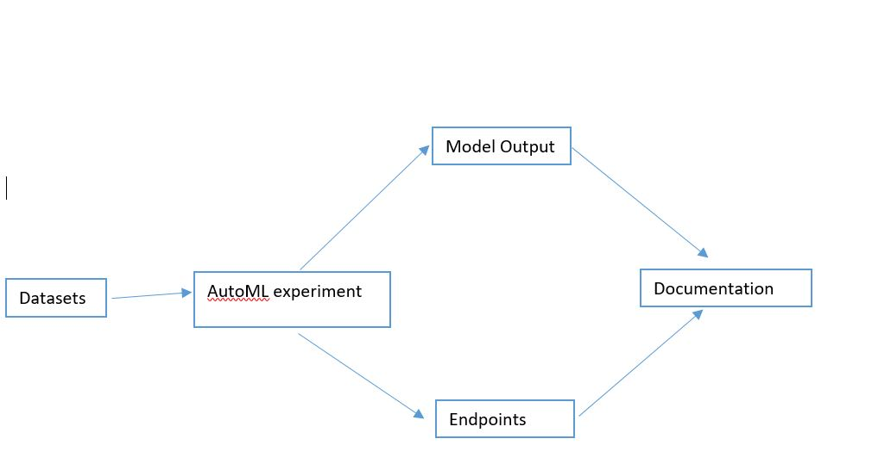
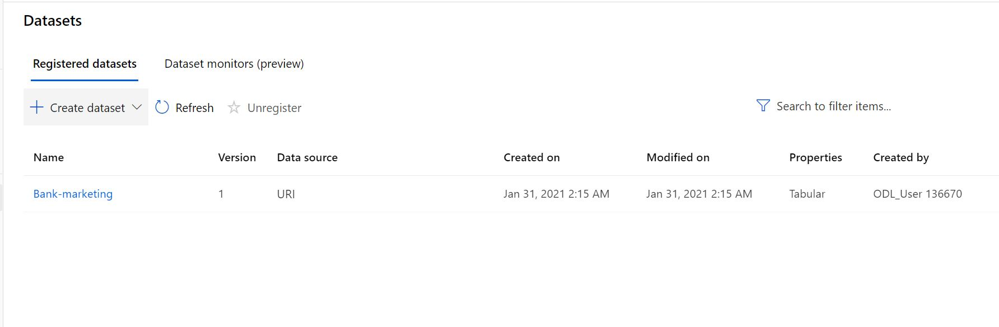
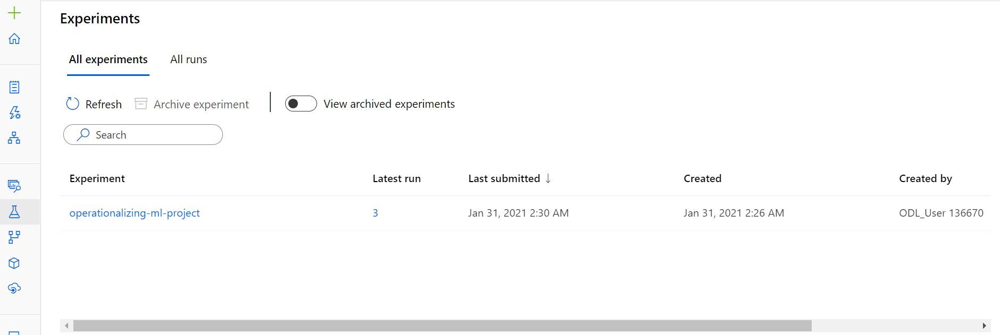
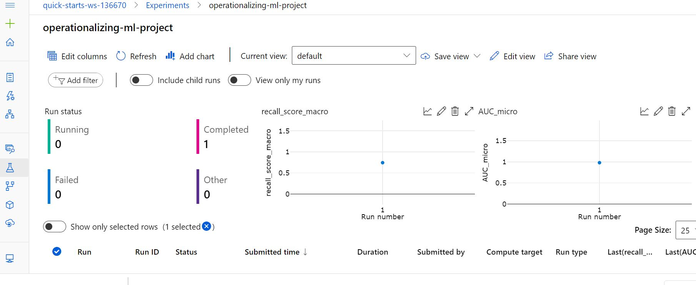
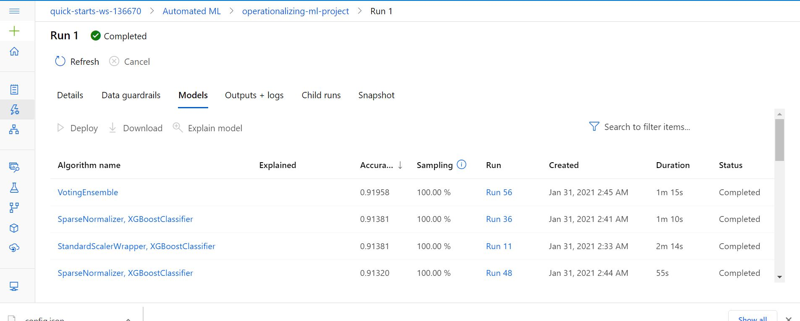
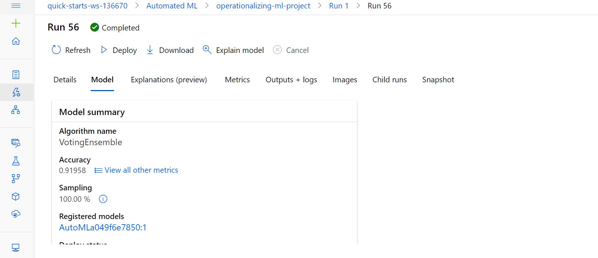
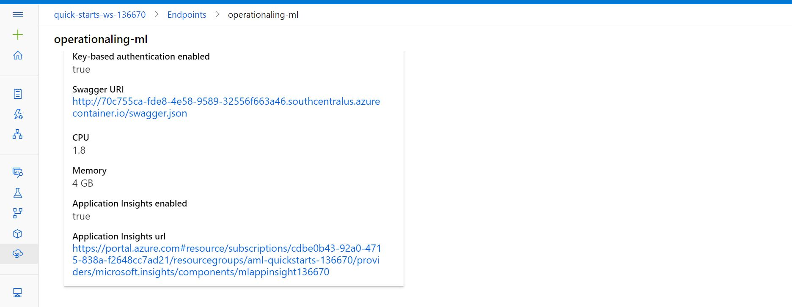
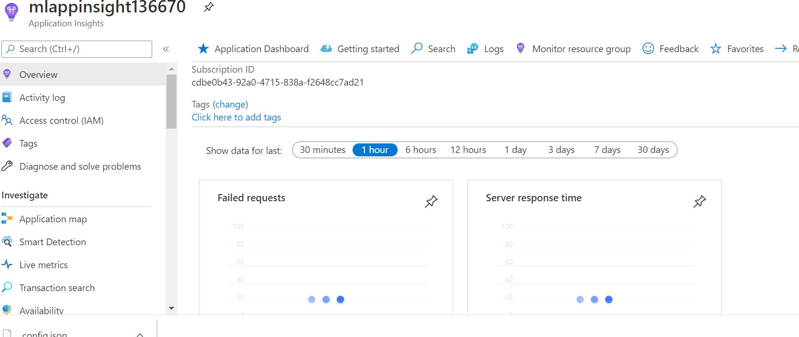
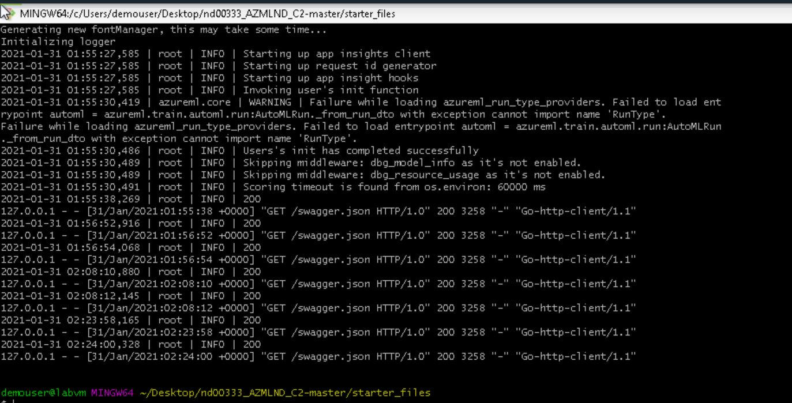

# Operationalizing Machine Learning

Microsoft provides a cloud based solution with a Machine Learning component (Azure ML service) that provides the capacity to train, develop and deploy a Machine Learning mode into product. This project used <a href='https://automlsamplenotebookdata.blob.core.windows.net/automl-sample-notebook-data/bankmarketing_train.csv'>Bank Marketing dataset</a> to train a machine learning algorithm with AutoML, deploy it and consume. In another stage, a pipeline was created, published and consumed. The approach followed in this project is as shown below;

* Authentication
* Automated ML Experiment
* Deploy the best model
* Enable logging
* Swagger Documentation
* Consume model endpoints
* Create and publish a pipeline
* Documentation

## Architectural Diagram
 

## Improving the Projects

The project can be improved further through;
* Increasing the compute instances from CPU to GPU or more advanced instance that will accelerate a faster AutoML training

## Key Steps
### Step 1 - Authentication

The authentication was automatically done on the `Project Lab - VM` 

### Step 2 - AutoML Experiment

In creating the AutoML Experiment to train and deploy the model for consumption, the `Banking dataset` was first loaded after which the experiment then created and a compute cluster created to run the classification ML experiment.

The image of the datasets, experiment, and model after the experiment below.

#### Dataset
 

#### Completed Experiment

 
 

#### Best Model
* Trained Model
 

* Best Model Selected
 

### Step 3 -Deploy the Model 

The best model trained from the AutoML run after the successful run of the experiment was deployed using Azure Container Instance (ACI) with authentication enabled.

### Step 4 - Enable Logging
Retrieving logs after model deployment plays an important role in debugging errors and exceptions encountered during the model development life-cycle. To retrieve logs after model deployment application insights has to enabled. The code file `logs.py` was populated with details with application insights set to true and the code was executed.

#### Application Insight Enabled

#### Logs Running

#### Logs Running Terminal

## Screen Recording
*TODO* Provide a link to a screen recording of the project in action. Remember that the screencast should demonstrate:

## Standout Suggestions
*TODO (Optional):* This is where you can provide information about any standout suggestions that you have attempted.
