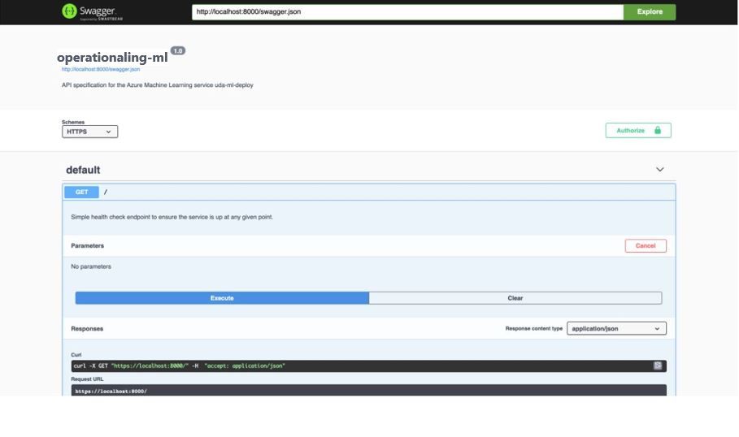
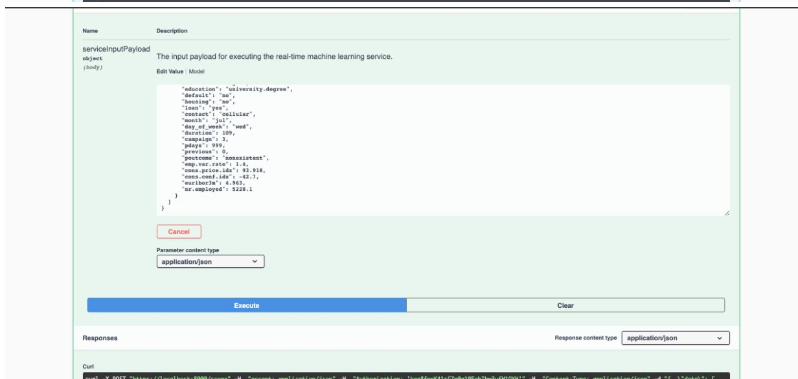
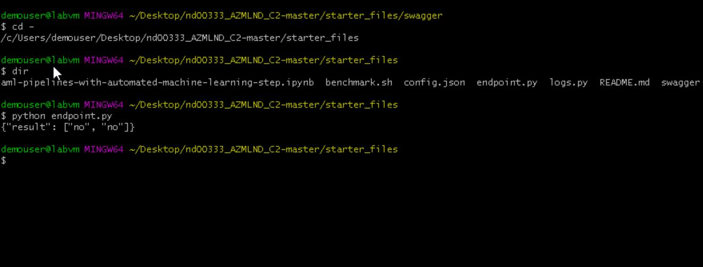
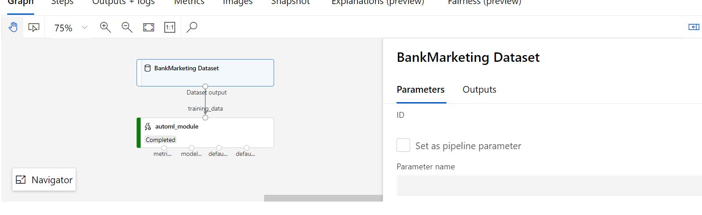
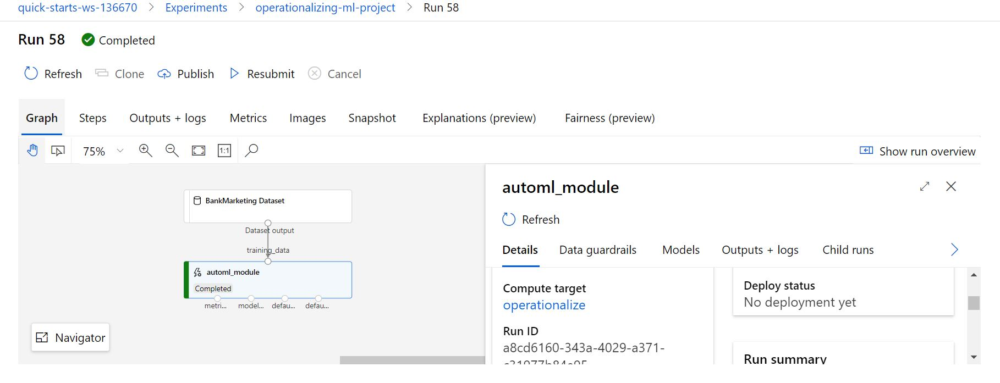
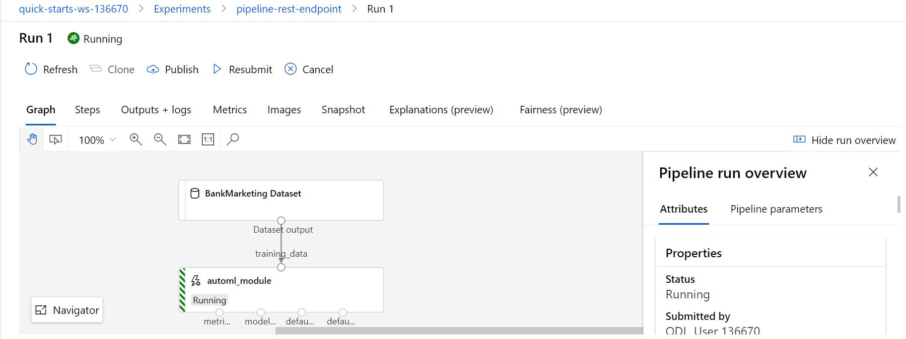
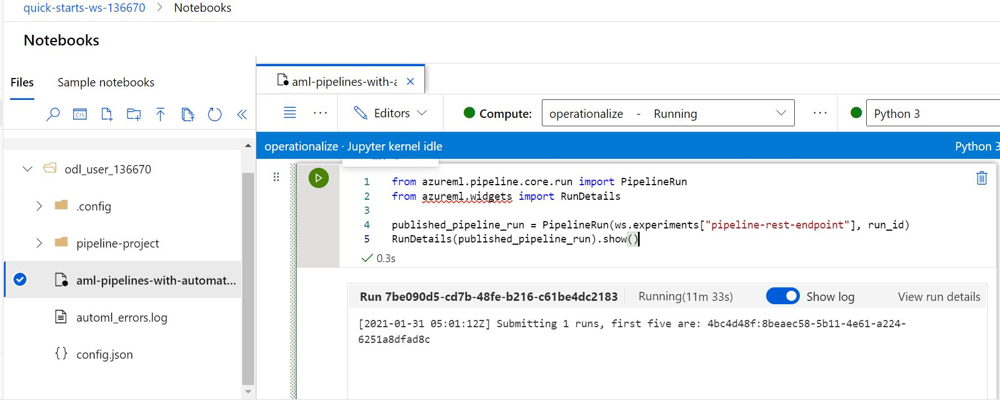
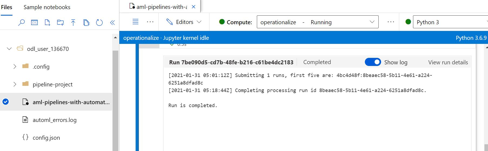

# Operationalizing Machine Learning

Microsoft provides a cloud based solution with a Machine Learning component (Azure ML service) that provides the capacity to train, develop and deploy a Machine Learning mode into product. This project used <a href='https://automlsamplenotebookdata.blob.core.windows.net/automl-sample-notebook-data/bankmarketing_train.csv'>Bank Marketing dataset</a> to train a machine learning algorithm with AutoML, deploy it and consume. In another stage, a pipeline was created, published and consumed. The approach followed in this project is as shown below;

* Authentication
* Automated ML Experiment
* Deploy the best model
* Enable logging
* Swagger Documentation
* Consume model endpoints
* Create and publish a pipeline
* Documentation

## Architectural Diagram
 

## Improving the Projects

The project can be improved further through;
* Increasing the compute instances from CPU to GPU or more advanced instance that will accelerate a faster AutoML training
* A data processing pipeline can be parsed before the training run and more feature engineering can be performed to create more features that will improve the performances of the model

## Key Steps
### Step 1 - Authentication

The authentication was automatically done on the `Project Lab - VM` 

### Step 2 - AutoML Experiment

In creating the AutoML Experiment to train and deploy the model for consumption, the `Banking dataset` was first loaded after which the experiment then created and a compute cluster created to run the classification ML experiment.

The image of the datasets, experiment, and model after the experiment below.

#### Dataset
 

#### Completed Experiment

 
 

#### Best Model
* Trained Model
 

* Best Model Selected
 

### Step 3 -Deploy the Model 

The best model trained from the AutoML run after the successful run of the experiment was deployed using Azure Container Instance (ACI) with authentication enabled.

### Step 4 - Enable Logging
Retrieving logs after model deployment plays an important role in debugging errors and exceptions encountered during the model development life-cycle. To retrieve logs after model deployment application insights has to enabled. The code file `logs.py` was populated with details with application insights set to true and the code was executed.

#### Application Insight Enabled

#### Logs Running

#### Logs Running Terminal

### Step 5 - Swagger Documentation

For this step, after locating the Azure provided swagger json file and downloading it, a swagger container was running on port 80, and the python file `serve.py` was used to create a serve that is listening on port 8000. Once the UI is created, the API is interacted with. The Swagger output is displayed below

### Step 6 - Consume Model Endpoints

At this stage the model has been deployed and can be interacted with as a request to the trained model. The `endpoint.py` was executed with the correct `scoring_uri` and `key` updated in the script. A result is generated after running the script for the sample data as shown below;

### Step 7 -  Create and Publish a Pipeline
The task here is to create and publish a pipeline leveraging on the Jupyter Notebook. The notebook is uploaded to the Azure ML studio and the appropriate parameters are provided where required, and the `config.json` download and put in the same directory. All the cells were executed which creates the Pipelines as shown below;
In this step, the task is to create and publish a pipeline. The Jupyter Notebook is uploaded to the Azure ML studio. The right environment variables are provided, and the .

#### Create Pipeline

#### Jupyter Notebook - UseRunWidget

##### Jupyter Notebook - UseRunWidget

## Screen Recording
<a href='https://youtu.be/-oiPVgv0d98'>Recordings</a>

